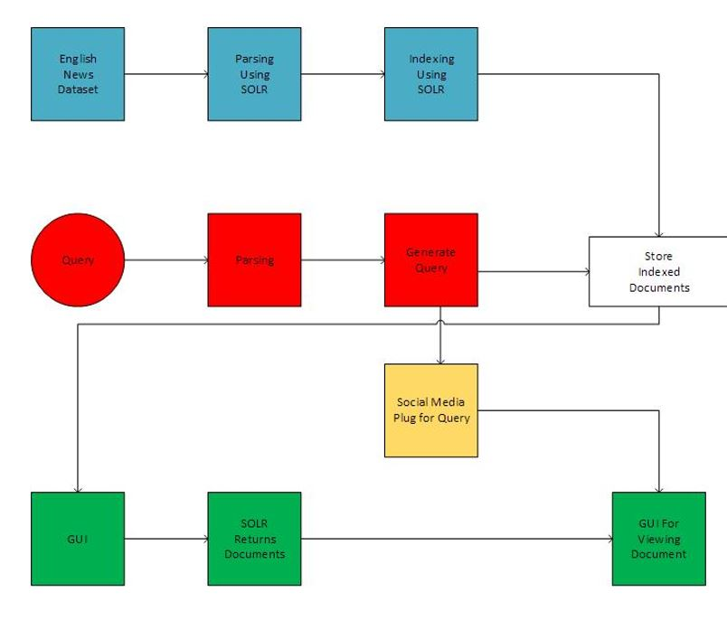
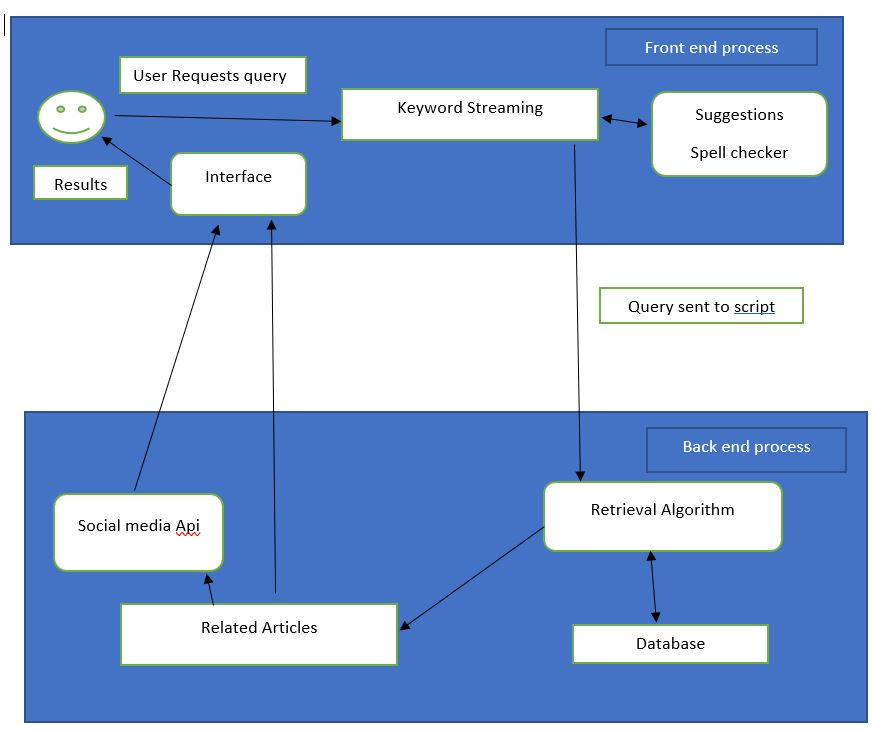

# Search Engine on SOLR

## System Architecture

Firstly, dataset of English news Articles of almost 500k documents will be indexed in multiple solr servers. We have planned of using python for this.
Our front end will be based on javascript, html and css which will show a search bar.
Our web page will have following features:
•	Spell correction
•	Suggestions
•	Related articles
•	Related social media posts using API.

We have planned using json/xml format for data exchange between data layer and presentation layer.

## Experimental Design

### 1. Frameworks:

- For Data layer : Python (will explore existing libraries)
- For server architecture: Solr
- For Presentation layer: JavaScript, html and CSS
- For data exchange: xml/json

### 2.   Experimental Design:
